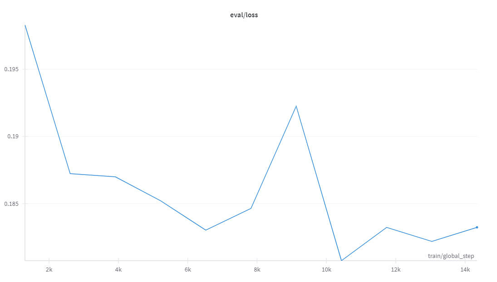

# Final Report

## Appraoch Summary
The ESCI task 1 objective is essentially semantic smiliarity reranking problem. Therefore I have :
1. Conducted research to identify and select a suitable cross-encoder model pre-trained on a large corpus of English text pairs and configured with Mean Squared Error (MSE) loss.
2. Preprocessed the original dataset by performing mapping, filtering, and column removal, and transformed the ESCI labels into numerical values scaled between 0 and 1 to align with the model's objective function. Text inputs were tokenized into a format compatible with transformers, including tokens, token type IDs, and attention masks.
3. Fine-tuned the selected model on the training set with overfitting monitored using an evaluation set.
4. Benchmarked the optimal model on the test set, assessipwdg its performance on key evaluation metrics.
## Model Selection
The selection of the best model for fine-tuning was guided by the following considerations:
1. Alignment with Task 1 Objectives:
Task 1 focuses on capturing semantic similarity between query-product pairs for ranking purposes.
To achieve this, the model should be capable of generating a relevance or similarity score between text pairs.
Given the need to capture rich contextual interactions between the query and the product title, a cross-encoder architecture was deemed the most suitable option.
2. Pretraining on Relevant Corpus : 
The model should be pretrained on a corpus that aligns with the task's requirements, particularly one designed for relevance ranking in English text.
3. Computational Feasibility: 
The model size should be manageable within the computational resources available to ensure efficient experimentation and timely feedback during training.

Based on these factors, the `ms-marco-MiniLM` series of BERT models was selected. This series is pretrained on the MS MARCO benchmark dataset and employs a cross-encoder structure, making it well-suited for the task. To enhance the model's ability to learn from the training dataset, the 12-layer encoder variant, `ms-marco-MiniLM-L-12-v2`, was ultimately chosen.

## Fine Tuning steps
The cross encoder model itself has a number of of hyperparameters including but not limited to `hidden_State_number`, `number of layers in encoders`, `number of attention heads`, `dropout rate`...etc. But since we are fine tuning the pretrained model we would keep this model wise hyperparameters unchanged. The core set of hyperparameters that I can fine tune on includes:
- max sequence length of input tokens
- batch size
- learning rate
- warm up ratio for linear scheduler (most used in bert fine tuning)
- optimizer algorithm and associated parameters like beta1,beta2...etc.
- weight decay coefficient
- number of epochs
- early stop patience
- layers to train (unfreezed parameters)
To fine tune the best model, I can use python libs like `Optuna` to implement a hyperparameter tuning pipeline to search for the best suit of hyperparameters for the task. However, due to the computation overheads and the computing resources I have on my hand, this approach would be too expensive for me to execute for this task. Based on what I have, I focused on manual experiment with fine tuning two hyperparameters, `learning rate` and `layers to train`. Other fixed hyperparameters I used is included in the below with justifications:

| Parameter               | Value    | Justification |
|-------------------------|----------|---------------|
| num_epochs              | 3        |    based on computation resources and experiment feedback timing           |
| max_length              | 512      |    default input lenghth used in the pretrained model, also considered product title and query max length            |
| batch_size              | 64       |    for faster iteration of experiment, I used max batch size that my training instance mem can handle           |
| warmup_ratio            | 0.1      |     in line with bert training research papers          |
| optimizer               | AdamW    |     in line with bert training research papers          |
| loss_function           | MSE      |     typical for cross encoder and task objective          |
| early_stop_patience           | 3      |     small number to stop overfitting and deliver quick experiment iteration          |

I have conducted three rounds of experiments:
1. only freeze the laster dense layer while keep the entire encoder and pooling layer freezed, set the learning rate equals to 1e-3 with linear decaying schedule.
2. unfreeze the entire model and set the learning rate equals to 1e-3 with linear decaying schedule.
3. unfreeze the entire model and set the learning rate equals to 7e-6 with linear warm up and decay schedule.

## benchmarking results
### Pretrained Model
| MRR@10            | NDCG@10          | PRECISION@10     | RECALL@10       |
|--------------------|------------------|------------------|-----------------|
| 0.9129104832437505 | 0.8362555589285509 | 0.7702037735017303 | 0.5862534454251375    |
### Fine Tuned Model

| MRR@10            | NDCG@10          | PRECISION@10     | RECALL@10       |
|--------------------|------------------|------------------|-----------------|
| 0.9272703513727121 | 0.8570421593725694 | 0.7858752672529701 | 0.599515768    |
### Inference dataset
The test query/product pair is ranked and the outcome is provided in `./evalation_results/test_scores_n_rel.csv`

## key insights
- 1st experiment : the evaluation loss quickly drops to minimum point and shooting up, which indicates this model'limited learning capacity with only last layer unfreezed for training and get's overfitted quickly. I personally gauge with this configuration, the model's learnining capacity is not fully released and the task requires more learning power so the result is not ideal.
- 2nd experiment : In order to release the full learning capacity of the model, I release all parmaeters across each layer. With this configuration, the minimum evaluation loss becomes smaller. However, the overfitting also prevails after finishing up 1st epoch, and the gap between training loss and evaluation loss gets increasingly larger after that. This indicates a less aggresive learning rate and more optimized learning shcedule is required for better trainig.
- 3rd experiment : I decreased the learning rate to 7e-6 and changed the learning schedule to linear warmup then decay as recommended by most of BERT training paper. As the result the model was able to continue to learn even after 1st epoch and the evaluation loss hits even lower mimium point. 